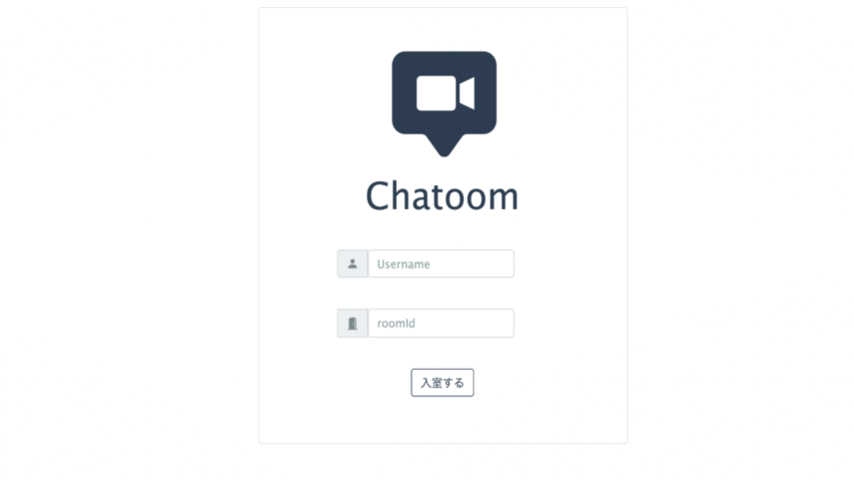
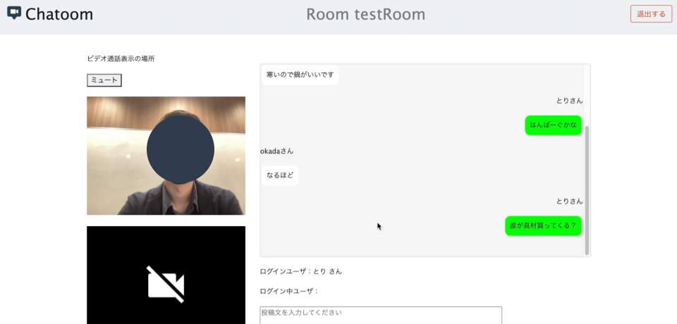

Chatoom
====

## アプリ概要

ハッカソン型インターンでチーム開発したアプリケーションです。
zoomやGoogleMeetなど既存のアプリだと、ミュートやビデオオフにしている人が利用しづらいという問題点に注目し、「チャット機能」メインの参加者全員が平等な通話アプリを開発しました。

## アプリの起動

1. 次のコマンドを実行します

    ```bash
    # アプリのディレクトリに移動
    cd ~/hackathon/chatapp
    # アプリの開発で使用するライブラリをインストール（初回のみ）
    npm install
    # 起動コマンドを実行
    npm start
    ```

2. `http://サーバのIPアドレス:ポート番号/` にブラウザでアクセスします

    例：`http://127.0.0.1:3000/`

## 機能

### 基本要件

#### ログイン画面

* ログイン画面からユーザ名を入力して「入室する」ボタンでチャット画面に遷移する
    * ユーザ名が未入力で「入室する」が押されたらエラーダイアログを表示する

#### 通話画面

* ログイン画面で入力されたユーザ名に「さん」を加えて表示する
    * 入力：山田太郎
    * 表示：ログインユーザ：山田太郎さん
* 「投稿」ボタンでメッセージを投稿する
    * 投稿されたメッセージは自分を含め、すべてのクライアントに投稿者名とともに表示される
* 「メモ」ボタンでメモを投稿する
    * 投稿されたメモは自分にだけ表示される
* 投稿は新しい順に表示される
* ユーザの入退室時に自分を除いた他のクライアントに入退室のメッセージが表示される
* WebRTCによる通話機能の実装を行う

### 追加要件

* UIを見やすいものにする
* ルームごとに部屋を分ける
* 入居者一覧を表示する
* 自分のチャットと他人のチャットを区別する（LINEっぽく実装）
* 複数人での通話ができるようにする、ミュート機能を追加する

### 画面

ログイン画面


通話画面



### 担当部分
* メモ機能実装
* Login画面、通話画面のUI整理
* アイコン作成、スライドデザイン